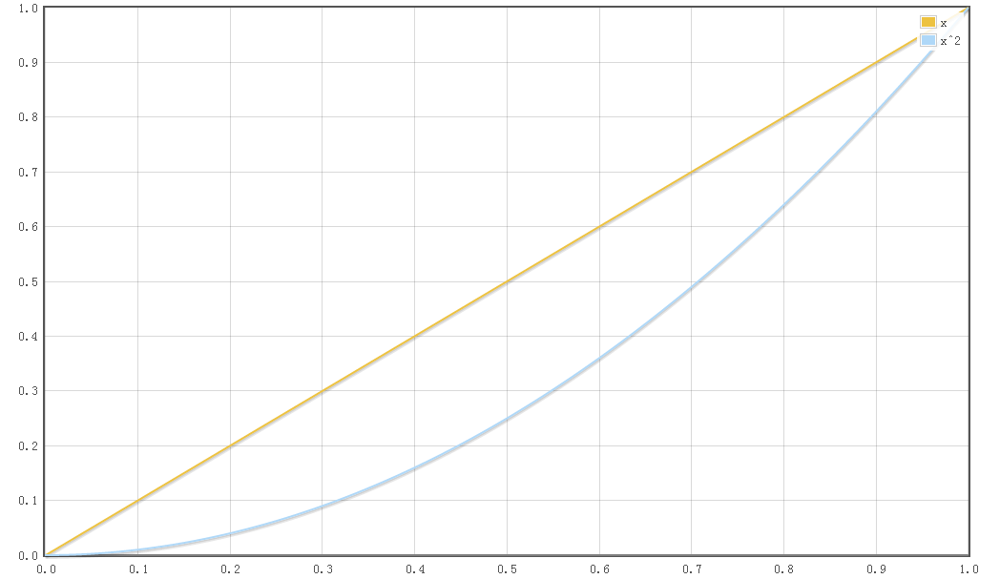
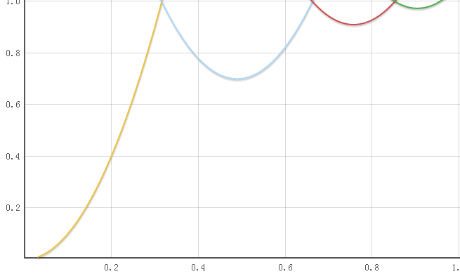

# javascript animation for bounce

这是一个JavaScript函数，用于模拟在生活中的真实弹跳。与现实生活一样，速度与时间成正比，位移与时间成平方比，与高中物理学中的v=gt和s=1/2\*gt^2类似。

# 效果图如下：


*这只是手稿！由于明天开始期末考试周，忙完考试后再将这里补充详细*
*This is just a draft ! Beacause of the final test for my school work , I will complete this later*

<br>
<br>
<br>

----------------------------------分割线---------------------------------

## 开始之前

在开始之前，关于动画有一篇很好的文章，这个程序的灵感大部分就来源于这里，强烈建议看一看:[https://javascript.info/animation](https://javascript.info/animation)

# 开始

##### 1.简单的JavaScript动画

首先对于JavaScript动画，一般运用 *setInterval()* 函数，每隔1/24秒，甚至更短时间，调用一次回调函数。然后在回调函数中，对CSS的值做出一些更改，例如：
``` javascript
var example = document.getElementsByClassName("example")[0];
var duration = 3000;               //动画持续总时间
var leftChange_total = 300;        //总共改变的CSS值
var leftChange_now = null;         //当前改变的CSS值

var handle = setInterval(()=>{
    //动画还未结束
    if(leftChange_now <= leftChange_total){
        leftChange_now += 300/3000/24;             //每次改变的CSS值=总CSS值/总时间/帧数
        example.style.left = leftChange_now;       //使用DOM接口写入left值
    } 
    else{
        clearInterval(handle);
    }   
},1000/24) //帧数为1秒24次，即24帧
```

这样的话就可以实现简单的JavaScript动画了。那么复杂的JavaScript动画呢？比如：不是匀速改变的CSS值。

##### 2.非匀速的JavaScript动画

什么叫做非匀速运动呢？ 从数学或者物理学上来讲，就是路程和时间不成一次函数关系，类比到JavaScript动画中，就是：**CSS值的改变和时间不成正比，即CSS值的改变快慢根据动画执行时间有所变化。请看下面的那张函数图**

>黄色线代表的是简单的匀速动画，蓝色线代表的是非匀速动画。由于动画进度与时间进度呈平方的关系，因此这个动画看起来应该是先慢后快，函数图像这样：其中纵坐标代表 **动画进度**，从0-1；横坐标代表 **时间进度**，从0-1.




因此，为了引入 *时间* 这个变量，我们放弃 *setIterval* 函数，作为替代而采用 *requestAnimationFrame* 函数。这是因为，*requestAnimationFrame* 函数的回调函数中，会默认传入一个 *time* 参数：
>引用来自MDN的介绍：这个参数的值是DOMHighResTimeStamp，指示从触发 requestAnimationFrame 回调到现在（重新渲染页面内容之前）的时间（从 performance.now() 取得）<br>(*当然如果在setIterval中手动通过 performance.now() 获取时间也是可以的。*)

>关于 *requestAnimationFrame* 的更详细介绍 ：[https://developer.mozilla.org/zh-CN/docs/Web/API/Window/requestAnimationFrame](https://developer.mozilla.org/zh-CN/docs/Web/API/Window/requestAnimationFrame)


那么，如何通过time参数创建非匀速的动画呢？

看下面：

``` javascript

var avatar = document.getElementById("avatar");
let duration_total = 3000;           //动画预计持续总时间
var start_time = null;               //由于time值并不是动画持续时间，而是页面加载总时间，因此需要一个值来记录动画从哪个时间开始的。

requestAnimationFrame(function avatar_anime(time){
    if(!start_time) start_time=time;                  //动画开始时间
    
    let duration_now = time - start_time ;            //动画目前持续时间
    let progess_time = duration_now/duration_total;   //计算时间进度百分比
    let progess_anime =  Math.pow(progess_time,2);    //动画进度百分比，动画进度与时间进度成平方关系


    avatar.style.top = 200*progess_anime + "px";
    if(duration_now < duration_total - 100){
        requestAnimationFrame(avatar_anime);
    }
    else{
        console.log("动画结束！");
    }
})

```

这个函数根据当前的*时间进度*，将其进行平方，计算出*动画进度*。这样看起来动画就是“先慢后快”，参考上面的那张函数图就非常清楚明白了。


# 深入

如果你仔细阅读并理解了上面那段代码，那么你应该有点思路了：只要能够写出将*时间进度*转换成*动画进度*的 *“转换函数”* ，那么理论上就可以创造出任何动画了。

例如，我要创建这个模拟自由落体运动的函数，那么函数图像应该是这样的：


>首先，动画进度呈二次函数递增；其次，到达“1”，即“落在地面上后”，反向弹起一定的高度，随后再增加到“1”。 整个过程中，假设二次函数的形式为 y=ax²+bx+c 那么要求整个过程中 “a” 的值保持恒定，即重力加速度恒定。

看到这里，想必你已经会差不多创建的自己的JavaScript动画了，唯一的缺乏的就是高中的数学知识了。如果你想稍微回忆一下高中的数学知识，可以继续看下去；如果你觉得你高中的数学知识还牢记于心，那么你完全可以开始编写自己的动画了！


# 附录：函数计算过程


假设：重力加速度为 g , 每次弹跳的高度均为上次的 z 倍 (0<z<1)。

##### 第一次落下 

函数：y=gx^2;<br>
与y=1的右交点：x1=√(1/g) 

##### 第二次落下

假设：y=g(x-b)^2+(1-z) 其中b代表函数左移距离，1-z代表回弹高度。<br>
代入上面第一次落下的 x=x1,y=1;<br>
计算得出：b2=√(1/g) + √(z/g) ，与y=1的右交点：x2=√(1/g) + 2*√(z/g) <br>

函数：y=g[x-(√(1/g) + √(z/g))]^2+(1-z);

##### 第三次落下

假设：y=g(x-b)^2+(1-z^2) 其中b代表函数左移距离，1-z^2代表回弹高度再次减半。<br>
代入上面第一次落下的 x=x1,y=1;<br>
计算得出：b3=√(1/g) + 2*√(z/g) + √(z^2/g) ，与y=1的右交点：x3=√(1/g) + 2*√(z/g) + 2*√(z^2/g) <br>

函数：y=g[x-(√(1/g) + 2*√(z/g) + √(z^2/g))]^2+(1-z);

##### 第N次落下

根据规律：<br>
函数：y=g[x-(bn-1 + √(z^(n-1)/g) + √(z^(n-2)/g))]^2 + (1-z^(n-1));<br>
其中：当且仅当n=1时，b1=0，y=gx^2。


